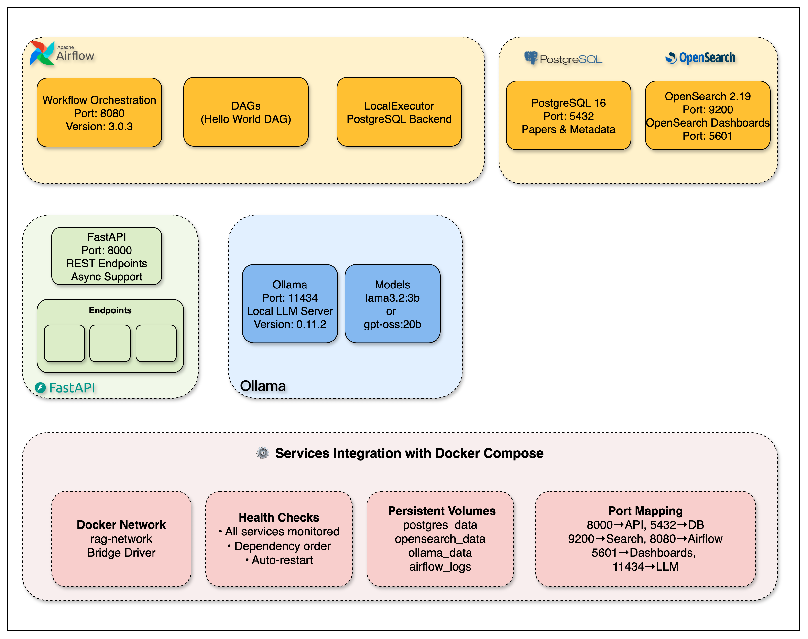

# Week 1: Infrastructure Setup and Verification

This folder contains the materials for Week 1 of the arXiv Paper Curator project, which focuses on setting up and verifying the complete infrastructure stack.

## Contents

### `week1_setup.ipynb`
A comprehensive Jupyter notebook that guides students through:

1. **System Requirements and Setup**
   - Understanding each technology component and its purpose
   - Cross-platform installation instructions (Windows, macOS, Linux)
   - Prerequisites verification with automated checking

2. **Infrastructure Architecture**
   - Complete overview of the multi-service architecture
   - Understanding how Docker containers communicate
   - Data persistence and volume management concepts

<p align="center">
  
</p>

**Architecture Overview:**
- **FastAPI** (Port 8000): REST API with async support and automatic documentation
- **PostgreSQL 16** (Port 5432): Primary database for paper metadata and content storage
- **OpenSearch 2.19** (Ports 9200, 5601): Hybrid search engine with management dashboards
- **Apache Airflow 3.0** (Port 8080): Workflow orchestration with DAGs and PostgreSQL backend
- **Ollama** (Port 11434): Local LLM server for future RAG implementation
- **Docker Network**: All services communicate via `rag-network` with persistent volumes

3. **Service-by-Service Setup**
   - PostgreSQL database for paper metadata storage
   - OpenSearch for full-text search capabilities
   - Apache Airflow for workflow automation
   - Ollama for local LLM inference
   - FastAPI for REST API endpoints

4. **Verification and Testing**
   - Automated health checks for all services
   - Step-by-step verification procedures
   - Modular Ollama testing (4 focused test cells)
   - Common troubleshooting scenarios and solutions

## Learning Objectives

By completing this week's materials, students will:

- Understand containerization and Docker Compose orchestration
- Learn how to set up a production-grade infrastructure stack
- Gain experience with database design and API development
- Master troubleshooting techniques for multi-service applications
- Learn direct HTTP API testing vs service abstraction layers
- Build confidence working with professional development tools

## Ollama Testing (Simplified for Week 1)

The notebook includes modular Ollama testing broken into focused cells:

- **Test 3A**: Check available models
- **Test 3B**: Simple model testing (if models installed) 
- **Test 3C**: Performance analysis
- **Test 3D**: Learning notes and setup commands

### Easy Model Installation (Optional for Week 1)

```bash
# Using Makefile (recommended)
make ollama-pull MODEL=llama3.2:1b
make ollama-test MODEL=llama3.2:1b

# Direct HTTP calls for learning
curl -X POST http://localhost:11434/api/pull -d '{"name":"llama3.2:1b"}'
curl -X POST http://localhost:11434/api/generate -d '{"model":"llama3.2:1b","prompt":"Hello","stream":false}'
```

### Recommended Models for Course

- **llama3.2:1b** (1.2GB) - Fast, good for testing
- **llama3.2:3b** (2.0GB) - Balance of speed/quality
- **llama3.1:8b** (4.7GB) - Better quality, slower

**Note**: No models are required for Week 1 - service health check works without them.

## Target Audience

This material is designed for:
- **Beginners** who want to learn modern software infrastructure
- **Students** looking to understand how real-world applications are built
- **Professionals** transitioning into software development or DevOps
- **Anyone** interested in building their own AI-powered research tools

## Time Commitment

- **Setup**: 2-3 hours (including software installation and downloads)
- **Notebook completion**: 1 hours
- **Total**: 2-4 hours

## 📖 Additional Resources

**Week 1 Blog Post:** [The Infrastructure That Powers RAG Systems](https://jamwithai.substack.com/p/the-infrastructure-that-powers-rag)
- Deep dive into each infrastructure component
- Production deployment considerations
- Architecture decision explanations

## Support Resources

If you encounter issues:
1. Check the troubleshooting sections in the notebook
2. Review the common problems and solutions
3. Ensure all prerequisites are properly installed
4. Follow the step-by-step verification procedures
5. Ask in Jam With AI substack chat channel

## Next Steps

After completing Week 1, you will be ready to:
- Understand how each service contributes to the overall system
- Modify and extend the infrastructure as needed
- Proceed to Week 2: arXiv Integration and PDF Processing
- Build confidence in working with professional development environments